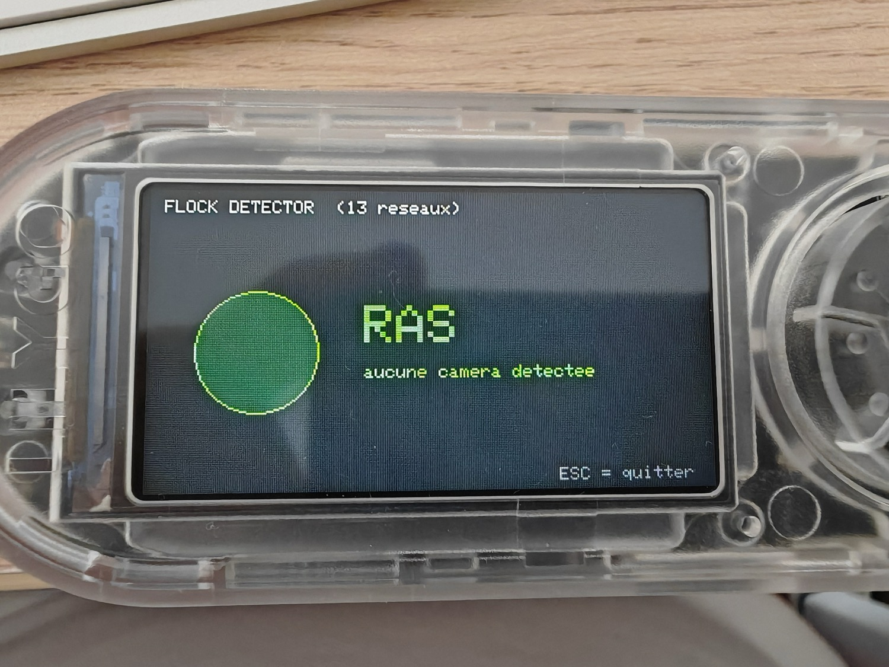

# 🛰️ Flock Detector — détecteur de caméras de surveillance pour Bruce

  

> **EN** — A **counter-surveillance** script (JavaScript) for the **[Bruce firmware](https://github.com/BruceDevices/firmware)** on the LilyGO T-Embed CC1101. It scans WiFi and flags **Flock Safety** (and similar) surveillance cameras by their **MAC OUI** or an SSID containing `flock`, sorted by signal so you can locate the nearest one. Defensive / privacy research only.

Script **JavaScript** pour le firmware **[Bruce](https://github.com/BruceDevices/firmware)** (testé sur **LilyGO T-Embed CC1101**). Il scanne le WiFi et **signale les caméras de surveillance type Flock Safety** par leur **préfixe MAC (OUI)** ou un **SSID contenant `flock`**, triées par puissance pour repérer la plus proche. Outil **défensif / vie privée**.

## ✨ Fonctionnalités (v2)

- **Scan WiFi en boucle** avec un **modèle de confiance à 4 niveaux** (repris des recherches flock-you / FlipDeFlock) :

  | Niveau | Règle | Couleur |
  |---|---|---|
  | 🔴 **CONFIRMED** | SSID `Flock-XXXXXX` (6 hex, ancré) **ou** `test_flck` (SSID de dev, **CVE-2025-59409**) → auto-identifiant | rouge |
  | 🟠 **LIKELY** | SSID contient `flock` | orange |
  | 🟡 **POSSIBLE** | MAC OUI ∈ **32 préfixes corroborés** | ambre |
  | ⚪ **WEAK** | MAC OUI ∈ liste **seed** (réelle mais non vérifiée terrain) | gris |

  > L'OUI seul est **faible volontairement** : certains préfixes (`a4:cf:12`, `3c:71:bf`…) sont des plages **Espressif génériques** partagées par d'innombrables ESP32 → faux positifs. Le signal fort, c'est le **SSID**.

- **🔊 Bip Geiger** — cadence et hauteur qui **accélèrent en te rapprochant** (mains libres, tu marches sans fixer l'écran). Coupe-le avec `BEEP = false`.
- **💾 Log SD (CSV)** — chaque **nouvelle** détection écrite dans `/flock_log.csv` (`time,ssid,mac,rssi,canal,niveau,raison`). Coupe-le avec `LOG = false`.
- **Persistance inter-scans** — une cible perdue sur un scan flaky **reste affichée** (TTL 20 s, grisée quand ancienne) au lieu de disparaître/clignoter.
- **Liste triée** par niveau puis RSSI, **barre de proximité** sur la cible vivante la plus forte, **« CLEAR »** vert quand rien n'est détecté.

## 📷 Mode « Hidden Cams » — caméras espion chinoises (v3)

Au lancement, un **menu à deux niveaux** (catégorie → sous-catégorie) :

- **WiFi scan** → Hidden cams · Flock (ALPR) · Both
- **LAN scan** → Camera hosts (voir plus bas)
- **Database** → **Update cams** (télécharge les signatures depuis GitHub) · Show counts

Le **nombre de signatures dans la base** est affiché à l'écran (splash + bas de l'écran). Le mode caméra cible les **caméras WiFi bon marché** (AliExpress/Amazon, apps V380/Yoosee/iCSee/JXLCAM/CamHi/UBox/Linklemo/FtyCam/O-KAM/Zosi…) — **~108 signatures caméra** :

- 🔴 **CONFIRMED — SSID de setup/AP** (très distinctif) : `MVxxxxxxxx` (V380), `GW_IPC…`/`GW_AP…` (Yoosee), `ACCQ…`/`CAMS_…`/`A9mini…` (A9), `JXLCAM`, `HDWiFiCam`, `V720`, `IPCAM-xxxxxx` (CamHi/CamHiPro), `DGK-xxx-xxx`, `CAM_xxxx`, `ESCAM-…`, `GENBOLT…`, `EZVIZ_<serial>` (EZVIZ), `UBox_…` (app UBox), `LLM_…` (app Linklemo), `FTY…` (FtyCam/FtyCamPro), `@MC…` (O-KAM), `IPC_AP_…` (Zosi).
- 🟠 **LIKELY — marque/mot-clé dans le SSID** : SmartLife/Tuya, YCC365, CloudEdge, iCSee, XMEye, Xiaomi (chuangmi), Anran, Sricam, ESCAM, Anbiux, Foscam, ieGeek, GENBOLT, LookCam, CamHi, Fredi, TinyCam, HDSmartIPC, Reolink, EZVIZ, UBox, Linklemo, ULar, UCOCARE, WIWACAM, HDMiniCam, FtyCam, O-KAM, Zosi, VStarcam, Coolcam + génériques `ipcam / webcam / spycam / wificam / netcam / smartcam / minicam / ptz / cctv / camera`.

### 🔄 Mettre à jour la base sans reflasher (Database → Update cams)

Les signatures caméra vivent aussi dans **[`sigs.json`](sigs.json)** à la racine du repo. Le menu **Database → Update cams** télécharge ce fichier depuis GitHub (`raw.githubusercontent.com/koua29/bruce-flock-detector/main/sigs.json`), **fusionne** les nouveautés dans la base en mémoire (dédupliquées) et **met en cache sur SD** (`/flock_sigs.json`). Au démarrage suivant, le cache SD est rechargé automatiquement → **plus besoin de rééditer le script** pour ajouter des caméras : il suffit que `sigs.json` soit enrichi côté repo. (Nécessite que le LilyGO soit connecté au WiFi/Internet.)

> ⚠️ **Le HTTPS peut échouer sur Bruce** (la pile TLS de l'ESP32 manque parfois de RAM, et GitHub n'est accessible qu'en HTTPS). Si **Update cams** affiche `Download failed`, l'écran donne l'erreur exacte **et la parade hors-ligne, garantie** :
>
> **MàJ hors-ligne (sans internet)** : copie [`sigs.json`](sigs.json) sur la **carte SD** sous le nom **`/flock_sigs.json`** (racine SD) — via la WebUI Bruce ou un lecteur de carte. Il est **rechargé et fusionné automatiquement au démarrage** (`loadCachedSigs`). Aucun TLS requis.

Format `sigs.json` : `cam_ssid_conf` `[["regex","label"]]`, `cam_ssid_like` `[["substr","label"]]`, `cam_oui` `[["oui","vendor"]]`, `flock_oui` `["oui"]`, `flock_seed` `["oui"]`.

### 🌐 Mode « LAN cams » — caméras déjà connectées au WiFi

Sur le réseau WiFi auquel le LilyGO est **connecté**, ce mode balaie le sous-réseau et repère les **hôtes caméra** par leurs **ports** (`554`/`8554` RTSP, `37777` Dahua, `34567` XiongMai, `8000` Hikvision, `8899` ONVIF) et la **bannière HTTP** (Hikvision/Dahua/Reolink/Foscam/ONVIF…). C'est le complément du scan RF : il attrape la cam **déjà appairée** (client silencieux), invisible en scan d'AP.

> ⚠️ **Limites (firmware Bruce)** : l'interpréteur JS n'expose que `httpFetch` (pas de socket brut, pas d'UDP, pas d'ARP) → détection **par ports + bannière uniquement, sans OUI/MAC**, et **pas de ONVIF WS-Discovery**. Le timeout de connexion **n'est pas réglable** (`httpFetch` n'a aucune option de timeout) → **on ne peut pas raccourcir l'attente d'une IP morte**. La parade n'est donc pas « éviter les IP mortes » (impossible : on ne le sait qu'après le timeout) mais **en sonder beaucoup moins** :
> - balayage **d'une fenêtre autour de notre propre IP** (`LAN_SPAN`, ±25 par défaut) + la passerelle — le DHCP attribue les adresses en grappe, donc peu d'IP mortes ;
> - **une seule sonde par IP** (port `554` d'abord : ouvert = cam, RST = hôte vivant qu'on creuse, timeout = mort → on passe).
>
> Pendant une sonde bloquante, le JS est figé : **ESC n'est lu qu'entre deux sondes** → **maintiens ESC**, l'arrêt se fait dès la fin de la sonde en cours. Règle `LAN_SPAN` en tête de script.

> 💡 **Marques no-name (AliExpress/Amazon)** : la plupart (JOOKACE, Bextgoo, TANGMI, pokurui, Nisanmoon, keft, LXMIMI, Digimore, ViiRou, ULEXOR, Voltvera, Swiftctrl, SecuraLen, Yadayuki…) **ne diffusent pas leur nom de marque** — elles réutilisent une app P2P partagée. Repère l'**app** (imprimée sur la boîte / dans l'App Store) : `UBox_` → **UBox**, `LLM_` → **Linklemo**, `MVxxxxxxxx` → **V380**, `ACCQ`/`CAMS_` → **A9/JXLCAM**, `IPCAM-` → **CamHi**, `EZVIZ_` → **EZVIZ**. Si l'app apparaît dans la liste ci-dessus, la caméra est couverte.
- 🟡 **POSSIBLE — OUI de marque** : **Hikvision, Dahua, Reolink, Wyze, Foscam, Ring** (43 préfixes ; extensible). Marques « routeur d'abord » (TP-Link/Tapo) **exclues** volontairement — leur OUI en scan d'AP = aimant à faux positifs.

> ⚠️ **Limite honnête** : on ne voit une caméra que si elle **diffuse un WiFi** (mode appairage/AP, ou fraîchement branchée). Une caméra **déjà appairée** est un simple **client** (pas de SSID) → **invisible** en scan d'AP. Pour celles-là : mode **promiscuous** (firmware) ou un **détecteur d'objectif** (LED IR). Les no-name utilisent des chipsets génériques (HiSilicon/Espressif) → l'**OUI seul reste faible**, le **SSID est le vrai signal**.

Enrichis `CAM_SSID_CONF`, `CAM_SSID_LIKE` et `CAM_OUI` en tête du script.

## 🚀 Installation

1. Copie **`Flock Detector.js`** sur la carte SD, dans un dossier que Bruce lit : **`/BruceJS`**, `/scripts` ou `/BruceScripts`.
2. Sur l'appareil : **JS Interpreter** → ouvre `Flock Detector.js`.
3. **Choisis le mode** (Hidden cams / Flock / Both).
4. **Maintiens le bouton ESC / retour** pour quitter (le scan WiFi bloque ~4 s ; une fenêtre réactive capte l'appui entre deux scans).

## 🔎 Signatures & sources

- **32 OUIs corroborés** (`OUI_CONF`) — recherche promiscuous de **[@NitekryDPaul](https://github.com/nitekry/nite-oui-collection)** (`my_tested_flock`, synchro **2026-07-16**) + le 32ᵉ (`82:6b:f2`) du drive-testing **[DeFlockJoplin](https://github.com/DeflockJoplin/flock-you)**.
- **6 OUIs seed** (`OUI_SEED`) — candidats **non vérifiés terrain** de **[FlipDeFlock](https://github.com/ReconGrunt/FlipDeFlock)** / WatchFlock.
- **Règles SSID** : `Flock-XXXXXX` (ancré) et `test_flck` (dev, **CVE-2025-59409**) = confirmés ; `flock` (sous-chaîne) = probable.
- *(Signal BLE : réservé à une future version firmware — l'API `ble.scan` de Bruce ne donne pas les fingerprints IE nécessaires.)*

**Caméras (mode Hidden Cams)** : patterns SSID de setup/AP des apps P2P grand public (V380 `MV+8`, Yoosee `GW_IPC/GW_AP`, A9/JXLCAM `ACCQ/CAMS_/JXLCAM`, HDWiFiCam, V720), marques (Tuya/SmartLife, YCC365, CloudEdge, iCSee/XMEye, Xiaomi) et OUIs Hikvision. Bases OUI surveillance : **[colonelpanichacks/ouispy-detector](https://github.com/colonelpanichacks/ouispy-detector)**, **[FlipDeFlock](https://github.com/ReconGrunt/FlipDeFlock)**.

Tu peux enrichir `OUI_CONF`, `OUI_SEED`, `CAM_SSID_CONF`, `CAM_SSID_LIKE`, `CAM_OUI` en tête du script. Autres bases : **[colonelpanichacks/flock-you](https://github.com/colonelpanichacks/flock-you)**, **[deflock.me](https://deflock.me)**.

## ⚠️ Portée & limites (honnêtes)

- Cette version JS voit les équipements qui **diffusent un réseau WiFi visible** (beacon/AP). Le détecteur de référence attrape aussi les **probe requests** via le **mode promiscuous** — ça nécessite un **module firmware** (upgrade possible).
- Les OUIs génériques (Espressif) peuvent générer des **faux positifs** : un hit **OUI seul** est marqué *« à confirmer »*, un hit **SSID:flock** est fiable.
- Outil de **sensibilisation / recherche vie privée**. Respecte la loi locale.

## 🧭 Angle mort & méthodes complémentaires

Cet outil détecte le **RF WiFi** : une caméra qui **diffuse un AP** (mode appairage) ou dont la MAC apparaît. Il **ne voit pas** une caméra **déjà appairée** (simple client silencieux) ni une caméra **offline** qui enregistre sur carte SD sans émettre. Pour ces cas, d'**autres méthodes** existent — complémentaires, pas concurrentes :

| Méthode | Principe | Attrape notre angle mort ? | Réf. |
|---|---|---|---|
| **RF / WiFi — scan AP** (cet outil) | scan des AP + OUI/SSID | — | ce repo |
| **Scan LAN** (cet outil, mode LAN cams **et** PC) | même réseau : ports (554 RTSP…) + bannière ; version PC : nmap + mDNS/ONVIF + OUI | ✅ cam **appairée sur ce WiFi** | ce repo, [room-sweep](https://github.com/grahamandre23-lang/room-sweep), [camera-detector](https://github.com/ranjansinghx/camera-detector) |
| **Optique (ToF/LiDAR)** | reflet rétro-réfléchi de l'objectif via le capteur ToF d'un smartphone | ✅ **toute** cam, même offline | [LAPD](https://github.com/frizensami/lapd) (ACM SenSys 2021) |
| **Thermique (IA)** | signature de chaleur de la cam via caméra thermique + réseau de neurones | ✅ **toute** cam, même offline | [HeatDeCam](https://heatdecam.github.io/) |
| **Vision (ML)** | webcam + détection d'objets (TensorFlow COCO-SSD) | ⚠️ visuel, faible | [Spy_Cam_Detection](https://github.com/tanishqshah2/Spy_Cam_Detection) |
| **Détecteur d'objectif IR** | LED IR + œil : l'objectif renvoie un point brillant | ✅ cam offline, bon marché | matériel dédié |

Les OUI Hikvision/Dahua/Reolink/Wyze/Foscam/Ring de la base viennent en partie des projets de scan LAN ci-dessus.

## 🛒 Matériel / Hardware

Le matériel utilisé pour ce projet — liens affiliés Amazon :

|  |  |  |
|:---:|:---:|:---:|
| 🔌 **[LilyGO T-Embed CC1101](https://link.amazon/B0cgD7wou)** avec antennes | ⬛ **[LilyGO T-Embed CC1101](https://link.amazon/B071fmsbH)** noir, sans antenne | 📡 **[Kit d'antennes SMA](https://link.amazon/B0eMlSqeZ)** |

En tant que Partenaire Amazon, je réalise un bénéfice sur les achats remplissant les conditions requises. · As an Amazon Associate I earn from qualifying purchases.

## ☕ Un café ?

## 📄 Licence

MIT — voir [LICENSE](LICENSE). Par **koua29**. Signatures : projet flock-you / deflock.me.
