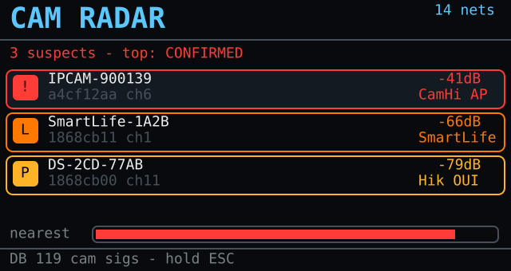
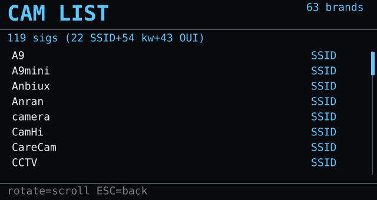
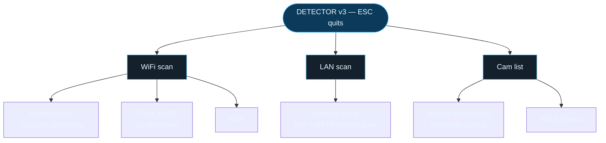
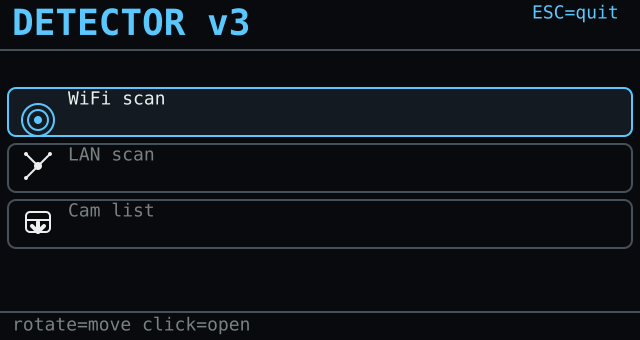
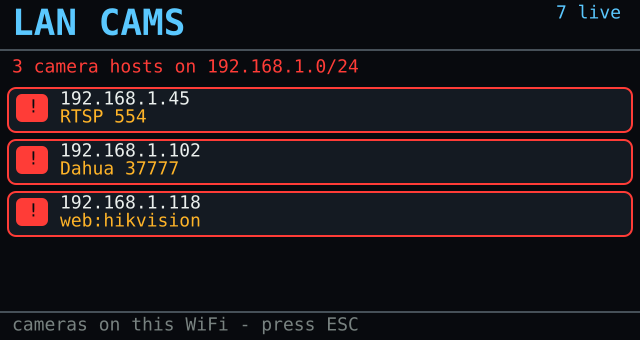
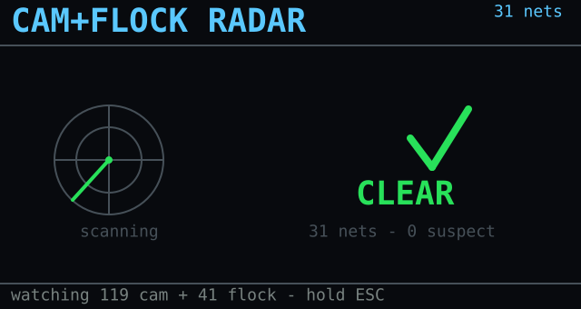

# 🛰️ Flock Detector — surveillance-camera detector for Bruce

  

A **counter-surveillance** JavaScript app for the **[Bruce firmware](https://github.com/pr3y/Bruce)** (tested on **LilyGO T-Embed CC1101**). It scans 2.4 GHz Wi-Fi and flags:

- **Flock Safety** (and similar) **ALPR** cameras, and
- cheap **Chinese Wi-Fi "spy" cameras** (AliExpress/Amazon),

by their **MAC OUI** or their **setup-AP SSID**, ranked by a 4-level confidence model and by signal strength so you can walk toward the nearest one (Geiger beep). A separate **LAN scan** mode finds cameras already joined to the Wi-Fi you're on. **Defensive / privacy research only.**

  
  &nbsp;
  

> ## ⚠️ Authorized use only
> Use this **solely** to check for surveillance devices around **you**, or networks/spaces you are **authorized** to inspect. It is a **passive receiver** — it never connects to, streams from, deauths, or exploits anything. Respect your local law.

## 🧭 Menu map

  
  
  

## 🎯 Confidence model

Every hit is ranked, because **OUI alone is weak** (many camera/ALPR modules share generic Espressif/HiSilicon MAC ranges used by countless devices). The **SSID is the reliable signal.**

| Tier | Rule | Colour |
|---|---|---|
| 🔴 **CONFIRMED** | self-identifying SSID: `Flock-XXXXXX`, `test_flck` (**CVE-2025-59409**), or a camera setup-AP name (e.g. `MV########`, `GW_IPC…`, `IPCAM-…`) | red |
| 🟠 **LIKELY** | SSID contains a brand / keyword (`flock`, `v380`, `ipcam`, …) | orange |
| 🟡 **POSSIBLE** | MAC OUI in a corroborated / camera-brand list | amber |
| ⚪ **WEAK** | MAC OUI in an unverified "seed" list | grey |

Extras: **🔊 Geiger beep** (faster/higher as you close in), **💾 SD CSV log** (`/flock_log.csv`), **cross-scan persistence** (a target lost on a flaky scan stays on screen, greyed, for 20 s), and a live **networks-scanned counter**. Toggle with `BEEP` / `LOG` at the top of the script.

## 🚀 Install

1. Copy **`Flock Detector.js`** onto the SD card, in a folder Bruce reads: **`/BruceJS`**, `/scripts` or `/BruceScripts`.
2. On the device: **JS Interpreter** → open `Flock Detector.js`.
3. Pick a category → mode. **ESC** quits from the top menu, or goes back one level from a submenu.

## 📷 Hidden-cam signatures

Most cheap no-name cameras **don't broadcast their brand name** — they reuse a shared **P2P app**, and the SSID comes from that app/chipset. Find the app (printed on the box / in the App Store) and match its prefix below.

<!-- BRANDS_TABLE_START -->
### Confirmed setup-AP SSID prefixes

| Brand / app | Setup SSID looks like |
|---|---|
| **A9** | `CAMS_…` |
| **A9mini** | `A9MINI…` |
| **CamHi** | `IPCAM-…` |
| **DGK** | `DGK-…` |
| **ESCAM** | `ESCAM-…` |
| **EZVIZ** | `EZVIZ-…` |
| **FtyCam** | `FTY…` |
| **GENBOLT** | `GENBOLT…` |
| **HDWiFiCam** | `HDWIFICAM…` |
| **IPcam** | `CAM_X…`, `IPC-…` |
| **JXLCAM** | `JXLCAM…` |
| **JXLCAM/A9** | `ACCQ…` |
| **Linklemo** | `LLM_…` |
| **Naxclow** | `NAX_…` |
| **O-KAM** | `@MC…` |
| **Ring** | `RINGSETUP…` |
| **UBox** | `UBOX_…` |
| **V380** | `MV########…` |
| **V720** | `V720…` |
| **Yoosee** | `GW_IPC…` |
| **Zosi** | `IPC_AP…` |

### Camera-brand MAC OUIs (POSSIBLE tier)

| Vendor | OUI prefixes |
|---|---|
| **Dahua** | 9 |
| **Foscam** | 2 |
| **Hikvision** | 23 |
| **Reolink** | 2 |
| **Ring** | 2 |
| **Wyze** | 5 |

> Router-first brands (**TP-Link / Tapo**) are **excluded on purpose** — on an AP scan their OUI is a false-positive magnet.

### Brand / keyword matches (LIKELY tier)

`anbiux` · `anran` · `camera` · `camhi` · `carecam` · `cctv` · `cloudedge` · `coolcam` · `escam` · `ezviz` · `foscam` · `fredi` · `ftycam` · `genbolt` · `hdminicam` · `hdsmartipc` · `hopeway` · `icsee` · `iegeek` · `imcam` · `ipcam` · `iwfcam` · `linklemo` · `littlestars` · `lookcam` · `minicam` · `naxclow` · `netcam` · `okam` · `ptz` · `reolink` · `smartcam` · `smartlife` · `spycam` · `sricam` · `tinycam` · `tutk` · `tuya` · `ubox` · `ucocare` · `ular` · `v380` · `vstarcam` · `webcam` · `wificam` · `wiwacam` · `xiaoin` · `chuangmi` · `xmeye` · `ycc365` · `yoosee` · `zosi`
<!-- BRANDS_TABLE_END -->

The full list, with counts and detection tags, is browsable on-device under **Cam list → Brands & models**.

## 🌐 LAN cams — cameras already on the Wi-Fi

The RF scan only sees a camera that **broadcasts an AP** (pairing/setup mode). A camera **already paired** is a silent Wi-Fi **client** with no SSID → invisible to an AP scan. **LAN cams** covers that blind spot: while the LilyGO is connected to a Wi-Fi, it sweeps the subnet and flags **camera hosts** by their **open ports** (`554`/`8554` RTSP, `37777` Dahua, `34567` XiongMai, `8000` Hikvision, `8899` ONVIF) and their **HTTP banner** (Hikvision/Dahua/Reolink/Foscam/ONVIF…).

> ⚠️ **Firmware limits.** Bruce's JS only exposes `httpFetch` (no raw sockets, no UDP, no ARP) → detection is **ports + banner only, without OUI/MAC**, and there's **no ONVIF WS-Discovery**. The connect timeout **can't be shortened**, so a dead IP is slow. The fix isn't "skip dead IPs" (you only know an IP is dead *after* the timeout) — it's to **probe far fewer**: a **window around our own IP** (`LAN_SPAN`, ±25) + the gateway (DHCP clusters addresses there), and **one probe per IP**. During a blocking probe the JS engine is frozen, so **hold ESC** — it stops as soon as the current probe returns.

## 📋 Cam list & updating the database

**Cam list → Brands & models** shows the total signature count and the sorted brand/model catalog, each tagged **SSID** / **OUI** / **SSID+OUI**.

The signatures also live in **[`sigs.json`](sigs.json)**. To **add cameras without re-editing the script**, drop a **`flock_sigs.json`** at the **SD-card root** (only the *new* entries) — it is **loaded and merged at boot** (`loadCachedSigs`), de-duplicated. New total shows up in **Cam list**.

> ℹ️ **Why SD and not internet?** GitHub is HTTPS-only and the ESP32 **TLS stack often fails on Bruce** (`Connection refused`). The SD update needs **no network** and always works.

`sigs.json` format: `cam_ssid_conf` `[["regex","label"]]`, `cam_ssid_like` `[["substr","label"]]`, `cam_oui` `[["oui","vendor"]]`, `flock_oui` `["oui"]`, `flock_seed` `["oui"]`.

## 🔎 Sources

- **Flock OUIs** — [@NitekryDPaul](https://github.com/nitekry/nite-oui-collection) promiscuous research (`my_tested_flock`, synced 2026-07-16) + [DeFlockJoplin](https://github.com/DeflockJoplin/flock-you); seed set from [FlipDeFlock](https://github.com/ReconGrunt/FlipDeFlock) / WatchFlock. SSID rules: `Flock-XXXXXX`, `test_flck` (CVE-2025-59409).
- **Camera OUIs** — [colonelpanichacks/ouispy-detector](https://github.com/colonelpanichacks/ouispy-detector), [room-sweep](https://github.com/grahamandre23-lang/room-sweep), [camera-detector](https://github.com/ranjansinghx/camera-detector).
- **Camera SSID prefixes** — public setup guides (qztsecurity, manuals.plus, vendor docs) and the naxclow / a9-v720 research.
- *(BLE signatures need promiscuous IE fingerprints not exposed by Bruce's `ble.scan` — left to a future firmware module.)*

## 🧩 Blind spot & complementary methods

This tool sees **RF Wi-Fi** only. A camera **already paired** (silent client) or **offline** (records to SD, emits nothing) is invisible to it. Other methods cover those — complementary, not competing:

| Method | Principle | Catches our blind spot? | Ref. |
|---|---|---|---|
| **RF / Wi-Fi AP scan** (this tool) | scan APs + OUI/SSID | — | this repo |
| **LAN scan** (this tool's LAN mode **and** PC tools) | same network: ports (554 RTSP…) + banner; PC: nmap + mDNS/ONVIF + OUI | ✅ camera **paired on that Wi-Fi** | this repo, [room-sweep](https://github.com/grahamandre23-lang/room-sweep), [camera-detector](https://github.com/ranjansinghx/camera-detector) |
| **Optical (ToF/LiDAR)** | lens retro-reflection via a phone's ToF sensor | ✅ **any** camera, even offline | [LAPD](https://github.com/frizensami/lapd) (ACM SenSys 2021) |
| **Thermal (ML)** | camera heat signature via thermal cam + neural net | ✅ **any** camera, even offline | [HeatDeCam](https://heatdecam.github.io/) |
| **Vision (ML)** | webcam + object detection (TensorFlow COCO-SSD) | ⚠️ visual, weak | [Spy_Cam_Detection](https://github.com/tanishqshah2/Spy_Cam_Detection) |
| **IR lens finder** | IR LED + eye: the lens returns a bright dot | ✅ offline cams, cheap | dedicated hardware |

## 🛒 Hardware

The gear used for this project — Amazon affiliate links:

|  |  |  |
|:---:|:---:|:---:|
| 🔌 **[LilyGO T-Embed CC1101](https://link.amazon/B0cgD7wou)** with antennas | ⬛ **[LilyGO T-Embed CC1101](https://link.amazon/B071fmsbH)** black, no antenna | 📡 **[SMA antenna kit](https://link.amazon/B0eMlSqeZ)** |

As an Amazon Associate I earn from qualifying purchases.

## ☕ Buy me a coffee?

## 📄 License

MIT — see [LICENSE](LICENSE). By **koua29**. Runs on the excellent [Bruce firmware](https://github.com/pr3y/Bruce). Defensive / authorized use only.
